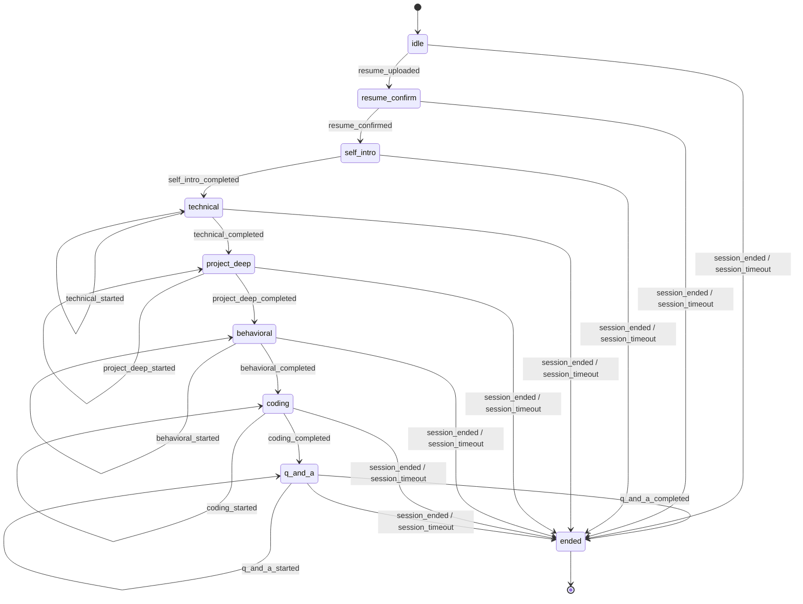

# 面试会话状态机

阶段枚举见 `interfaces.ts` 中的 `InterviewStage`。合法转移由 `interview-state-machine.ts` 中的表驱动；非法 `(阶段, 事件)` 会抛出 `SessionError`（`INVALID_EVENT` 或 `SESSION_ENDED`）。

## 转移图（Mermaid）

## 不允许的示例

- `technical` + `resume_confirmed`：事件与当前阶段不匹配，抛出 `INVALID_EVENT`。
- `technical` + `self_intro_completed`：同上。
- `ended` + 任意业务事件：抛出 `SESSION_ENDED`。

## Redis Key（前缀可配置 `redisPrefix`）

| Key | 含义 |
|-----|------|
| `{prefix}:session:{sessionId}:core` | 会话核心（阶段、配置、简历、元数据，不含消息体） |
| `{prefix}:session:{sessionId}:messages` | 短期消息列表（List，尾部为最新，`LTRIM` 限制条数） |
| `{prefix}:session:{sessionId}:profile` | 候选人画像 JSON |
| `{prefix}:session:{userId}:active` | 当前用户活跃的新版会话 ID（单活跃约束） |
| `{prefix}:session:user:{userId}:ids` | 用户会话 ID 索引集合 |
| `{prefix}:legacy:session:{sessionId}` | 旧版 REST 轮次会话 JSON |
| `{prefix}:legacy:user_sessions:{userId}` | 旧版用户会话集合 |

## 钩子

`SessionManager` 构造可选 `hooks.onStageExit` / `hooks.onStageEnter`，在阶段变更前后各调用一次（默认写结构化日志）。
